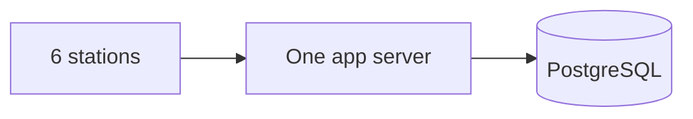
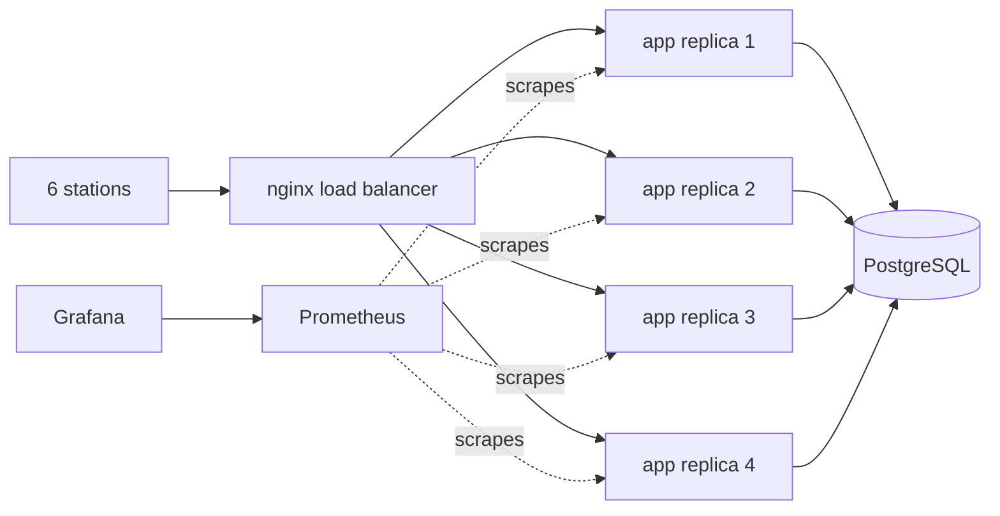
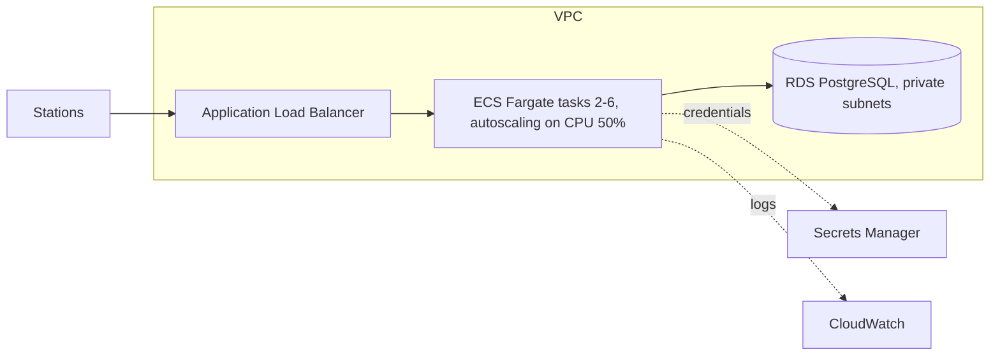
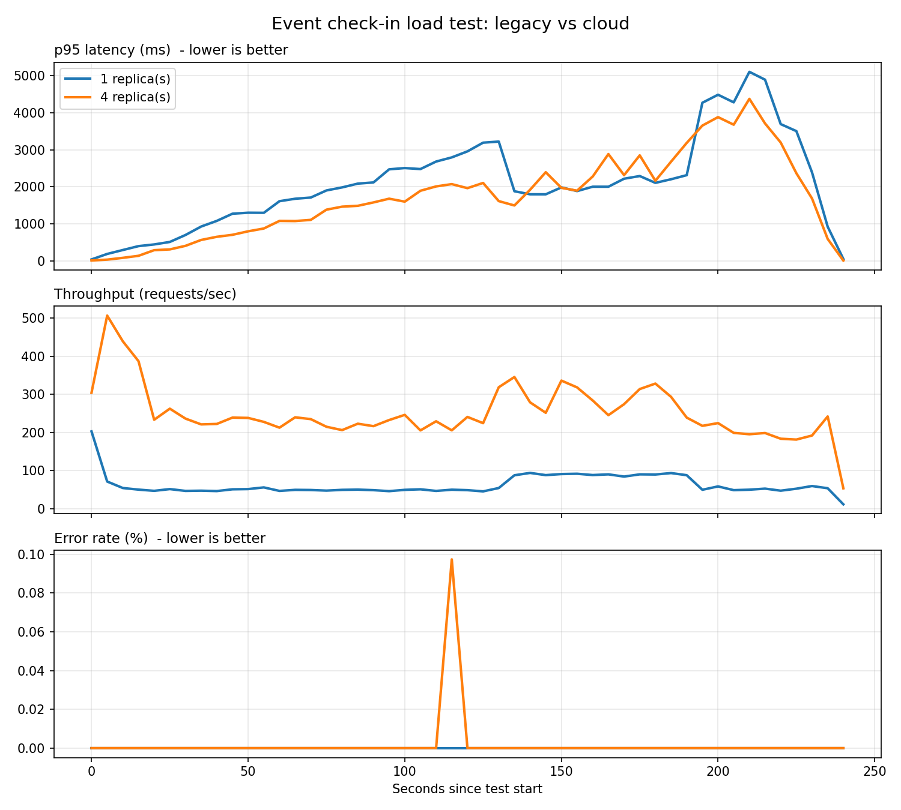

# Event Check-in System: from one server to a scalable, monitored design


A ticket check-in API for an event with ~10,000 attendees and 6 stations. A single
server struggles during the pre-doors rush, so I load-tested it, redesigned it with a
load balancer and multiple replicas, added monitoring and CI/CD, and designed the
equivalent AWS architecture in Terraform.

## What is real and what is designed
| Part | Status |
|---|---|
| Flask API + PostgreSQL, atomic check-in | Built and tested (unit + concurrency tests) |
| Single-server baseline | Run locally with Docker Compose |
| nginx + N replicas | Run locally with Docker Compose (one machine: demonstrates load balancing and horizontal scaling, not elastic cloud) |
| Prometheus + Grafana monitoring and alerts | Run locally |
| CI/CD (GitHub Actions to GHCR) | Running on GitHub |
| AWS architecture (ALB, ECS Fargate, RDS) | **Designed in Terraform and validated; not deployed** (AWS account verification was unavailable) |

## The problem
10,000 attendees, 6 stations, a sharp peak before doors open, then quiet. Two
requirements matter most: stations must never double-admit a ticket, and lookups must
stay fast at peak.

## Key design decision: atomic check-in
```sql
UPDATE tickets SET checked_in = TRUE, checked_in_at = NOW(), station_id = %s
WHERE ticket_id = %s AND checked_in = FALSE RETURNING attendee_name;
```
The "is it unused?" check and the write are one statement, so two stations scanning the
same ticket at the same instant cannot both succeed. `tests/test_concurrency.py` fires
100 simultaneous scans at one ticket against a real PostgreSQL and asserts exactly one is admitted.

## Architecture
**Before: single server**

**After: load-balanced replicas (local, Docker Compose)**

**Designed for AWS (Terraform, not deployed)**


## Results (k6, same script for every run)
Test: ramp to **[PEAK]** virtual users over 4 minutes, each acting as one of 6 stations.
Each replica capped at 0.5 CPU so the comparison is fair. Everything ran on one laptop,
so absolute numbers are indicative only.



| Setup | p95 latency (ms) | Throughput (req/s) | Error rate (%) |
|---|---|---|---|
| 1 replica | [X] | [X] | [X] |
| 4 replicas | [Y] | [Y] | [Y] |

**What I found:** [2 to 4 honest sentences. What changed, what didn't, and where the
next bottleneck was (for example the database or the load generator sharing the laptop).]

## Monitoring
Grafana dashboard (requests/sec, p95 latency, error rate, scan outcomes, healthy replicas)
and Prometheus alert rules (high latency, high error rate, replica down).


## CI/CD
On every push: unit tests plus the concurrency test against a PostgreSQL service
container. On `main`: build the Docker image and push it to GitHub Container Registry
(optionally triggering a Render deploy).

## Migration and cutover plan (legacy to the designed cloud setup)
1. **Prepare:** build the target environment (Terraform), push the image, verify `/health`.
2. **Dry run:** `pg_dump` the legacy database, restore into the new one, compare row counts.
3. **Freeze:** pause scanning briefly (or switch stations to read-only/offline list).
4. **Final sync:** take a final dump and restore; verify counts and checksums.
5. **Cut over:** point stations at the new load balancer URL.
6. **Rollback:** keep the old server and database untouched until the event ends; switch back if error rate rises.
For large live databases I would use AWS DMS instead of a dump.

## Cost
See [docs/aws-cost-estimate.md](docs/aws-cost-estimate.md).

## Limitations and next steps
- AWS design not deployed; a real deployment would show autoscaling behaviour that a single machine cannot.
- Production would add Multi-AZ RDS, a Redis cache for ticket lookups, offline fallback at stations, TLS on the load balancer, and private subnets with VPC endpoints.
- Load generator and system under test shared one laptop in local runs.

## Run it yourself
See [GUIDE.md](GUIDE.md).
